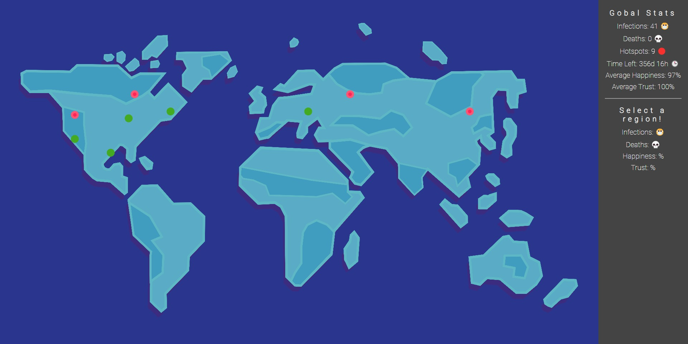

# Plague Prevention Simulator

## Description

This project has been inspired by the Corona Virus and the ongoing struggle of governments to keep it under control. This simple game simulates how a virus spreads through a population and how different measures can be used to prevent it from spreading. It also shows population stats like happiness, health and wealth.

## Screenshots

### Loading Screen

### Game Screen

